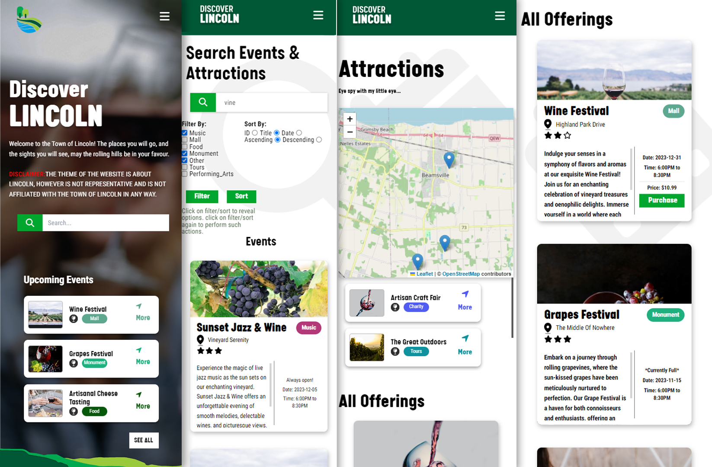

# Preamble
Hi! This is the "fixed-up" version of my teams' mock project during my time at Civiconnect, including my efforts in migrating to my own content server implementation. The [front end code](./src), and the [back end code](./server/) are both on this repository. 


## Gallery





# Nextjs Template v13.4.4
This readme was adapted from Civiconnect's template.

# Pre-Install
Please ensure you have the latest LTS Nodejs version installed to effectively use this repository.
### [Nodejs LTS](https://nodejs.org/en)

# 🚀 Getting started with the Nextjs Template
1. Pull this template repository to your local machine
2. Install and build:
```bash
# front end
npm install
npm run build

# back end
cd ./server
npm install
```

3. Run
- Alternatively, you to skip building, you may run a dev environment.


Front end:
```bash
npm start
# or "npm run dev" to run a dev environment
```

Back end:
```bash
cd ./server 
npm start
# or "npm run dev" to run a dev environment
```


## Installed Dependencies/plugins
- FontAwesome Icons
- Axios
- TailwindCSS
- Styled JSX

## Installed Dependencies/plugins (server)
- Fuse.js
- Express.js
- cors

This is a [Next.js](https://nextjs.org/) project bootstrapped with [`create-next-app`](https://github.com/vercel/next.js/tree/canary/packages/create-next-app).


# Environment Variables
You can start editing the page by modifying `app/page.js`. The page auto-updates as you edit the file.

This project uses [`next/font`](https://nextjs.org/docs/basic-features/
font-optimization) to automatically optimize and load Inter, a custom Google Font.

<br/>
Thanks to Civiconnect for allowing me to upload this project.
